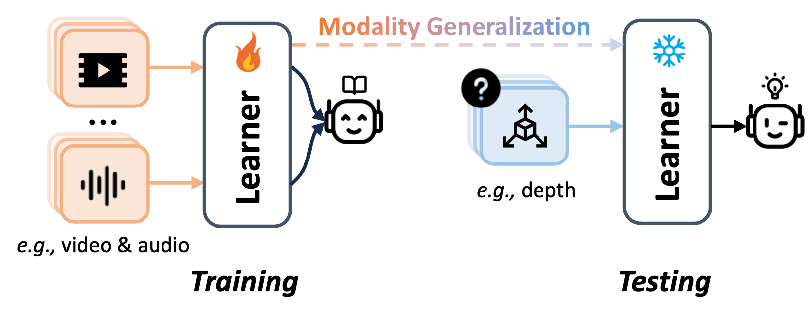
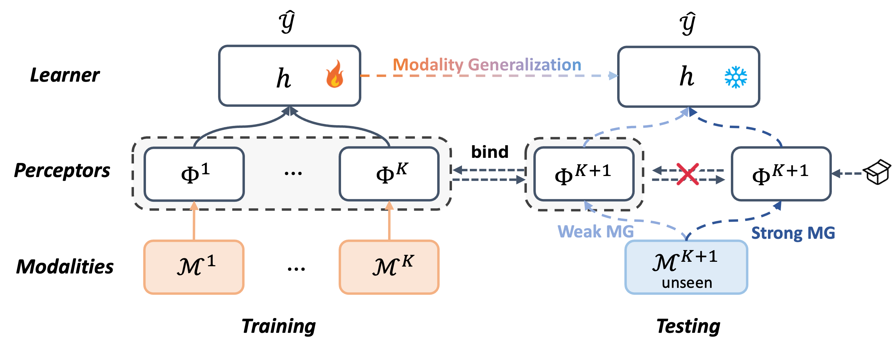
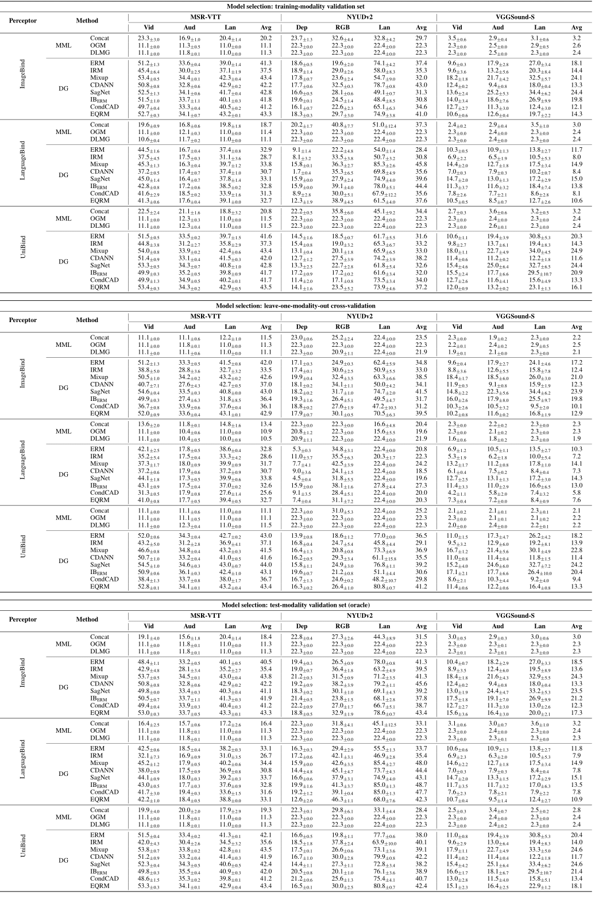
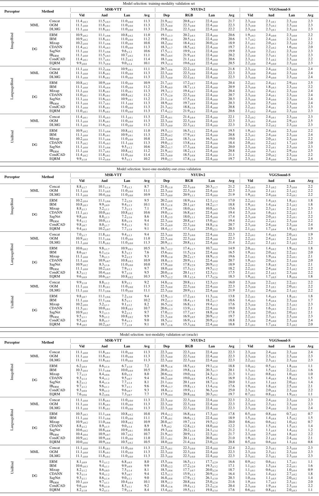

#  Welcome to ModalBed

ModalBed is a PyTorch-based framework designed to facilitate reproducible and solid research in modality generalization, as introduced in [Towards Modality Generalization: A Benchmark and Prospective Analysis](https://arxiv.org/pdf/2412.18277).


<p align="center">

<br/>
<strong>The problem of Modality Generalization (MG).</strong> The learner trained on multiple modalities (e.g., video or audio) is capable of performing well on unseen modalities (e.g., depth) during testing. 
</p>

<p align="center">

<br/>
<strong>The framework of ModalBed.</strong>
</p>


### Continual update!
ModalBed is an ongoing project that will be continually updated with new results, algorithms, and datasets. Contributions from fellow researchers through pull requests are highly encouraged and welcomed :).

See more details in [CONTRIBUTING.md](CONTRIBUTING.md) to contribut more [algorithms](modalbed/algorithms/README.md), [datasets](dataset/README.md), [perceptors](modal_encoder/README.md).


### Available algorithms

- Feature Concatenation (Concat)
- On-the-fly Gradient Modulation ([OGM](https://openaccess.thecvf.com/content/CVPR2022/papers/Peng_Balanced_Multimodal_Learning_via_On-the-Fly_Gradient_Modulation_CVPR_2022_paper.pdf))
- Dynamically Learning Modality Gap ([DLMG](https://openreview.net/pdf?id=QbsPz0SnyV))
- Empirical Risk Minimization ([ERM](https://www.wiley.com/en-fr/Statistical+Learning+Theory-p-9780471030034))
- Inter-domain Mixup ([Mixup](https://arxiv.org/abs/2001.00677))
- Class-conditional DANN ([CDANN](https://openaccess.thecvf.com/content_ECCV_2018/papers/Ya_Li_Deep_Domain_Generalization_ECCV_2018_paper.pdf))
- Style Agnostic Networks ([SagNet](https://arxiv.org/abs/1910.11645))
- Information Bottleneck ([IB_ERM](https://arxiv.org/abs/2106.06607))
- Conditional Contrastive Adversarial Domain ([CondCAD](https://arxiv.org/abs/2201.00057))
- Empirical Quantile Risk Minimization ([EQRM](https://arxiv.org/abs/2207.09944))

- Adaptive Risk Minimization ([ARM](https://arxiv.org/abs/2007.02931))
- ERM++: An Improved Baseline for Domain Generalization ([ERM++](https://arxiv.org/abs/2304.01973))
- Invariant Risk Minimization ([IRM](https://arxiv.org/abs/1907.02893))


### Available perceptors

- ImageBind ([paper](https://facebookresearch.github.io/ImageBind/paper), [codebase](https://github.com/facebookresearch/ImageBind))
- LanguageBind ([paper](https://arxiv.org/abs/2310.01852), [codebase](https://github.com/PKU-YuanGroup/LanguageBind?tab=readme-ov-file))
- UniBind ([paper](https://openaccess.thecvf.com/content/CVPR2024/papers/Lyu_UniBind_LLM-Augmented_Unified_and_Balanced_Representation_Space_to_Bind_Them_CVPR_2024_paper.pdf), [codebase](https://github.com/QC-LY/UniBind))

- Custom perceptors inherited from T5([paper](https://arxiv.org/abs/1910.10683), [codebase](https://huggingface.co/google-t5/t5-small)) and ViT([paper](https://arxiv.org/abs/2010.11929), [codebase](https://huggingface.co/google/vit-base-patch16-224)).

### Available datasets
- MSR-VTT: MSR-VTT: A Large Video Description Dataset for Bridging Video and Language
- NYUDv2: Indoor Segmentation and Support Inference from RGBD Images
- VGGSound: VGGSound: A Large-scale Audio-Visual Dataset

### Quick start

Download the dartasets:

```sh
python3 -m modalbed.scripts.download --dataset="msr_vtt"
```

Download the percetors:
```sh
python3 -m modalbed.scripts.download --perceptor="imagebind"
```

Train a model:
```sh
python3 -m modalbed.scripts.train --data_dir=./datasets/ --algorithm ERM --dataset NYUDv2  --test_env 0 --perceptor imagebind
```

Launch a sweep:
```sh
CUDA_VISIBLE_DEVICES=2,3 python -m modalbind.scripts.sweep launch --data_dir=./datasets/ --output_dir=./msrvtt_imagebind --command_launcher multi_gpu --datasets MSR_VTT --perceptor imagebind --n_hparams 3 --n_trials 3 --algorithms ERM IRM Mixup CDANN SagNet # ...
```

Collect the results (automatically generate the latex table in `modalbed/results`):
```sh
python -m modalbed.scripts.collect_results --mode=weak
```


### Acknowledgement
- [DomainBed](https://github.com/facebookresearch/DomainBed), a suite to test domain generalization algorithms.

### Citing ModalBed
If you find this repository useful, please consider giving a star ⭐ and citation
```
@misc{liu2024modalbed,
      title={Towards Modality Generalization: A Benchmark and Prospective Analysis}, 
      author={Xiaohao Liu and Xiaobo Xia and Zhuo Huang and Tat-Seng Chua},
      year={2024},
      eprint={2412.18277},
      archivePrefix={arXiv},
      primaryClass={cs.CV},
}
```


### Current results

<p align="center"> 



</p>

